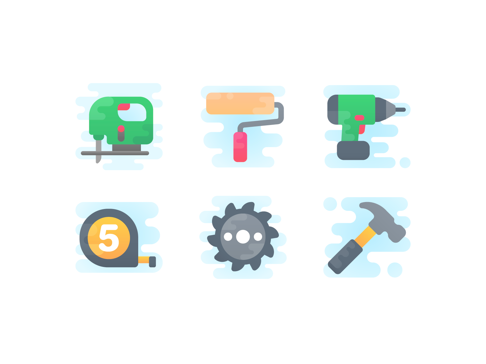

# 🔧 useful-kit



包含项目中各种功能代码的封装，简易实用，建议拿来直接在项目中使用。

## 📁 目录

```bash
____
  |---- debounce          // 防抖函数
  |---- draggable         // 封装拖拽库
  |---- img-retry         // 图片失败重试机制
  |---- is-iphonex        // 是否是刘海屏
  |---- pull-refresh      // 下拉刷新库
  |---- red-packet-css    // 红包旋转打开特效
  |---- svg-animate       // svg 路径动画特效
  |---- time-format       // 时间格式化函数
  |---- ts-fetch          // TS 封装的 fetch
  |---- ...
```